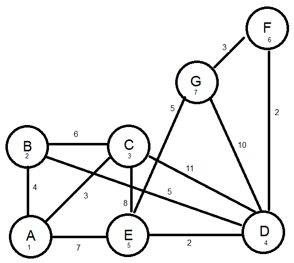

# Dijkstra algorithm in C

Implementation of Dijkstra algorithm in C to find the shortest path

## Usage
* First create nodes useing the funciton createAndInitNode()
* Second connect the nodes with edges using the function createEdge()
* Third add the nodes into the graph using the function insertIntoGraph()
* Fourth call the function Dijkstra and passing the graph, the starting node and the end node

## Exemple
The graph used as an example in the code\

